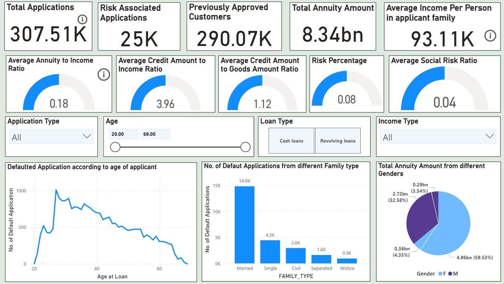
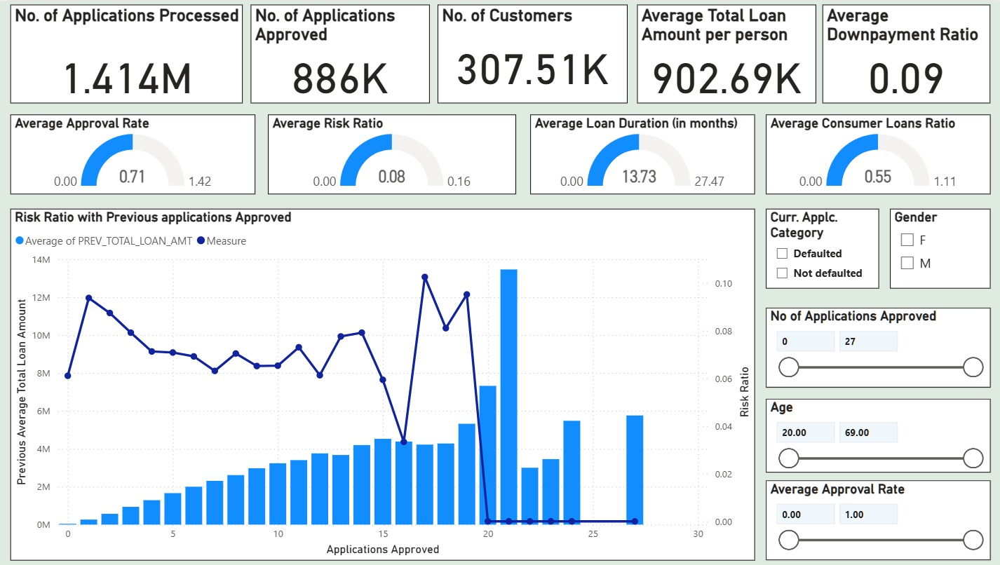
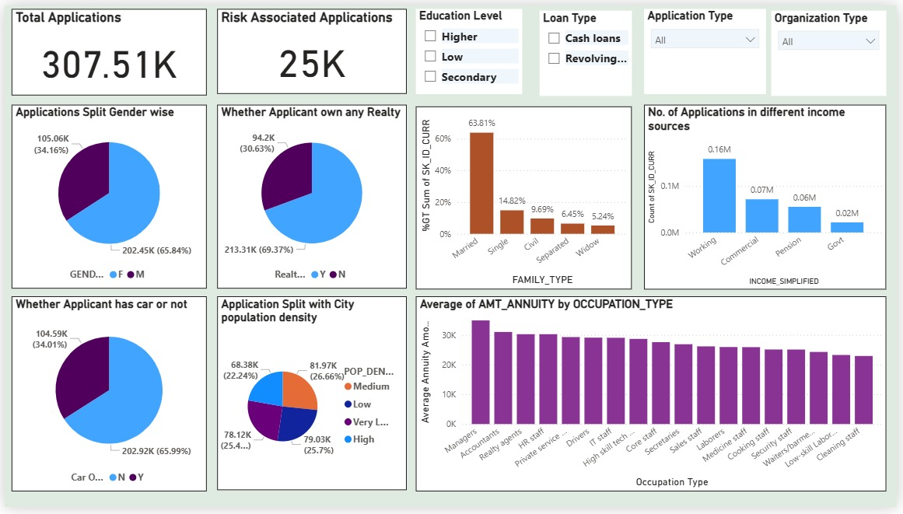
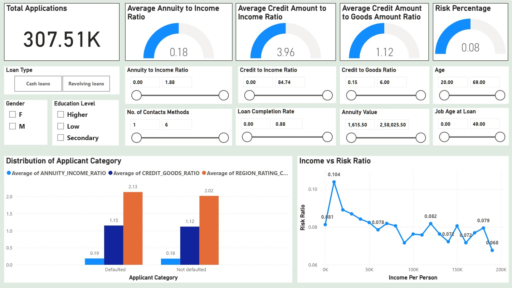

## **Power BI Dashboard**

### **1. Overview Page**
The **Overview Page** serves as the executive summary for the credit risk analysis, providing a high-level snapshot of the loan portfolio's health, applicant demographics, and key risk indicators. It is designed to allow stakeholders to quickly gauge the magnitude of applications, identify the volume of "at-risk" loans, and filter data by key demographics.

Overview Dashboard 
#### **Key Performance Indicators (KPIs)**
The top section highlights critical aggregate metrics:
* **Total Applications:** **307.51K** total loan requests processed.
* **Risk Associated Applications:** **25K** applications flagged as defaults (approx. 8% of total).
* **Previously Approved Customers:** **290.07K** applicants with a history of prior approvals.
* **Financial Scope:** A total annuity exposure of **8.34bn**, with an average per-capita family income of **93.11K**.

#### **Financial & Risk Ratios (Gauge Indicators)**
The second row visualizes critical financial health ratios that determine affordability and risk:
* **Average Annuity to Income Ratio (0.18):** On average, applicants spend 18% of their income on loan repayment, indicating a generally healthy affordability level.
* **Credit to Income Ratio (3.96):** The average loan size is nearly 4x the applicant's income.
* **Risk Percentage (0.08):** Confirms the overall portfolio default rate is steady at 8%.

#### **Interactive Filters**
The dashboard empowers users to slice the data dynamically using:
* **Age Slider:** Filters data for applicants aged **20 to 69**.
* **Loan Type:** Toggles between **Cash Loans** and **Revolving Loans**.
* **Demographic Dropdowns:** Allows filtering by **Application Type** and **Income Type**.

#### **Visual Insights & Breakdowns**
1.  **Default Trend by Age (Line Chart):**
    * *Chart:* "Defaulted Application according to age of applicant"
    * *Insight:* There is a distinct spike in defaults among younger applicants (peaking around late 20s to early 30s). As applicants age beyond 40, the number of defaults steadily declines, corroborating the EDA finding that older applicants generally display higher credit stability.

2.  **Defaults by Family Status (Bar Chart):**
    * *Chart:* "No. of Default Applications from different Family type"
    * *Insight:* **Married** applicants comprise the largest volume of defaults (**14.9K**), followed by **Single** (**4.5K**). *Note: While the volume is high for married individuals, this is likely driven by the fact that they make up the majority of the applicant pool.*

3.  **Annuity Distribution by Gender (Pie Chart):**
    * *Chart:* "Total Annuity Amount from different Genders"
    * *Insight:* **Females** account for the majority of the total annuity amount (**59.53%** or 4.96bn), compared to **Males** (**32.58%** or 2.72bn). This aligns with the observation that females apply for loans more frequently than males.

---
### **2. Previous Applications Distribution Dashboard**
This dashboard page shifts focus from the current applicant profile to their **historical banking behavior**. By analyzing the 1.4 million previous application records, this view helps the credit team understand the relationship between a customer's past loyalty (frequency of borrowing) and their current risk profile.

#### **Historical Volume & Operational Metrics (KPIs)**
The top header provides a summary of the operational scale and historical credit funnel:
* **Processing Volume:** **1.414M** previous applications have been processed in total.
* **Approval Volume:** **886K** of these applications were approved, indicating a historically active lending environment.
* **Customer Base:** These applications map back to **307.51K** unique customers.
* **Financial Average:** The average total loan amount per person historically stands at **902.69K**, with an average downpayment ratio of **0.09** (9%).

#### **Behavioral Ratios (Gauge Indicators)**
The second row visualizes the efficiency and nature of past lending:
* **Average Approval Rate (0.71):** Approximately 71% of past applications were approved, suggesting a moderately lenient historical approval policy.
* **Average Risk Ratio (0.08):** Consistent with the main overview, the historical risk ratio hovers at 8%.
* **Average Loan Duration (13.73 months):** Most historical loans were short-term, averaging just over 1 year.
* **Consumer Loans Ratio (0.55):** Over half (55%) of past lending activity was driven by consumer loans rather than cash loans.

#### **Key Visual Insight: The "Loyalty vs. Risk" Curve**
**Chart: Risk Ratio with Previous Applications Approved**
This combination chart is the centerpiece of the historical analysis, plotting **"Applications Approved"** (X-axis) against **"Total Loan Amount"** (Bars) and **"Risk Ratio"** (Line).

* **Loan Amount Trend (Bars):** There is a clear positive correlation between approval frequency and loan size. Customers with more approved applications (moving right on the X-axis) consistently secure higher total loan amounts, peaking near the 20-approval mark.
* **Risk Trend (Line):** The risk ratio (dark blue line) remains relatively stable between **6% and 8%** for customers with 1–15 past approvals. However, it shows volatility and a sharp decline for "super-borrowers" (20+ approvals), potentially indicating that highly frequent borrowers are either very safe or represent a distinct outlier segment.

#### **Interactive Filters**
This page allows for deep-diving into specific risk cohorts using:
* **Current Application Category:** Toggle between **Defaulted** and **Not Defaulted** to see if past history differs for current defaulters.
* **Approval Frequency Slider:** Filter for customers with a specific range of past approvals (e.g., 0 to 27).
* **Demographics:** Filters for **Gender** and **Age** allow for segmentation of historical trends.

---
### **3. Current Applications Distribution Dashboard**
This dashboard page focuses on the **sociodemographic profile** of the current applicant pool. Unlike the risk-centric views, this page is descriptive, helping the business understand *who* is applying for loans. It analyzes the distribution of applicants across gender, family status, asset ownership, and employment sectors.

#### **Key Portfolio Volume**
* **Total Applications:** **307.51K** unique applications are profiled here.
* **Risk Context:** Of these, **25K** are flagged as risk-associated, keeping the consistent 8% baseline visible for reference.

#### **1. Gender & Asset Ownership**
These visualizations highlight the gender imbalance and asset liquidity of the portfolio:
* **Gender Split:** The portfolio is predominantly female. **Female applicants** account for **65.84%** (202.45K) of the volume, while males account for **34.16%** (105.06K).
* **Real Estate:** A significant majority, **69.37%** (213.31K), own their own home or realty, suggesting a base level of asset stability for most applicants.
* **Vehicle Ownership:** In contrast to housing, car ownership is lower. **65.99%** of applicants do *not* own a car, which may correlate with the high volume of applications from lower-to-middle income segments.

#### **2. Family & Social Structure**
* **Family Status:** **Married** individuals form the overwhelming majority of applicants, representing **63.81%** of the total. Single applicants follow at **14.82%**, with Civil Marriage (9.69%), Separated, and Widows making up the remainder.
* **Income Source:** The "Working" class (blue collar/general workforce) submits the highest volume of applications (~0.16M), followed by "Commercial" associates (~0.07M) and Pensioners (~0.06M).

#### **3. Economic & Geographic Distribution**
* **City Population Density:** The application volume is remarkably balanced across different living environments. High, Medium, Low, and Very Low population density regions each contribute roughly **25%** of the total volume, indicating the lender has a consistent market penetration across both urban and rural settings.
* **Annuity by Occupation:** This bar chart reveals financial capacity by job type. **Managers** and **Accountants** carry the highest average annuity amounts (indicating larger loans and higher repayment capacity), while **Low-skill Laborers** and **Cleaning Staff** have the lowest average annuities.

---
### **4. Risk Drivers & Sensitivity Analysis Dashboard**
This dashboard page offers a granular "deep dive" into the current loan application pool. Unlike the high-level Overview, this view is designed for **sensitivity analysis**, allowing analysts to adjust specific financial levers (like annuity values or job tenure) to see how they impact risk profiles.

#### **Key Financial Ratios & KPIs**
The top section reiterates core portfolio metrics with a specific focus on collateral and affordability ratios:
* **Total Applications:** **307.51K** active files under review.
* **Credit to Goods Ratio (1.12):** This gauge is unique to this page. A ratio greater than 1.0 suggests that, on average, applicants are borrowing slightly more than the value of the goods they are purchasing (potentially for insurance or fees), which can be a risk signal.
* **Affordability Metrics:** The **Annuity to Income Ratio (0.18)** and **Credit to Income Ratio (3.96)** remain visible to monitor baseline affordability.

#### **Advanced Filtering & Sensitivity Controls**
This page features the most extensive set of filters, enabling "What-If" analysis:
* **Demographic Segmentation:** Checkboxes for **Gender** (M/F) and **Education Level** (Higher, Low, Secondary).
* **Risk Sliders:** Users can filter the entire dashboard by specific continuous ranges, such as:
    * **Job Age at Loan:** To isolate new employees vs. stable veterans.
    * **Loan Completion Rate:** To filter based on historical repayment progress.
    * **No. of Contacts:** To analyze if applicants providing more contact methods are more reliable.

#### **Visual Insights: Risk Drivers**
1.  **Distribution of Applicant Category (Defaulter vs. Non-Defaulter)**
    * *Chart:* Grouped bar chart comparing key averages for `Defaulted` vs `Not Defaulted` applicants.
    * *Insight:*
        * **Region Rating (Orange Bar):** Defaulters have a noticeably higher average Region Rating (**2.13**) compared to non-defaulters (**2.02**), suggesting that location/regional economic health is a predictive factor.
        * **Credit-to-Goods (Dark Blue Bar):** Defaulters also show a slightly higher gap between credit received and goods value (**1.15** vs **1.12**), indicating they may be financing more "extras" or have less downpayment coverage.

2.  **Income vs. Risk Ratio**
    * *Chart:* Line chart plotting **Risk Ratio** against **Income Per Person**.
    * *Insight:* There is a visible **inverse relationship** between income and risk.
        * **Highest Risk:** The risk peaks at **10.4%** for the lowest income bracket (near 0–20K).
        * **Lowest Risk:** As income rises to 200K, the risk drops significantly to **6.8%**.
        * **Volatility:** The curve is not perfectly smooth; there is a notable "bump" in risk around the **150K** income mark (**8.2%**), suggesting that higher income does not always guarantee lower risk—perhaps due to higher leverage in that segment.

