# Week 1: Data Exploration, Cleaning & Initial Insights

## 1. Business Understanding

### Business Goal
The primary objective is to minimize financial losses from loan defaults while maximizing the approval of creditworthy applicants. By analyzing historical loan application data, we aim to identify key indicators of default risk. This will enable the credit team to refine their approval criteria, implement risk-based pricing, or flag high-risk applications for manual review.

### Key Analysis Questions
1.  **What are the defining characteristics of applicants who default versus those who repay?** (Demographics, Income, Employment)
2.  **How does financial stability (Income, Credit Amount, Annuity) correlate with default risk?**
3.  **Are there specific loan types or contract terms associated with higher default rates?**
4.  **How does previous loan history influence current application performance?**
5.  **What data quality issues (missing values, outliers) need to be addressed before modeling?**

## 2. Data Structure & Quality Assessment

### Dataset Overview
-   **Application Data**: Contains client-level information for current loan applications.
    -   *Shape*: (307,511 rows, 122 columns)
    -   *Target Variable*: `TARGET` (1 = Default, 0 = Repaid)
    
    
-   **Previous Application Data**: History of previous loans for the same clients.
    -   *Shape*: (1,670,214 rows, 37 columns)
-   **Column Descriptions**: Metadata explaining the features.

### Data Quality Issues
-   **Missing Values**:
    -   Significant missing data in several columns. Top missing columns include housing-related information (e.g., `COMMONAREA_AVG`, `NONLIVINGAPARTMENTS_AVG`) and external source scores.
    -   *Action*: We will need to decide on imputation strategies (median, mode, or creating a "missing" category) or drop columns with excessive missingness (>50%) if they lack predictive power.
    
    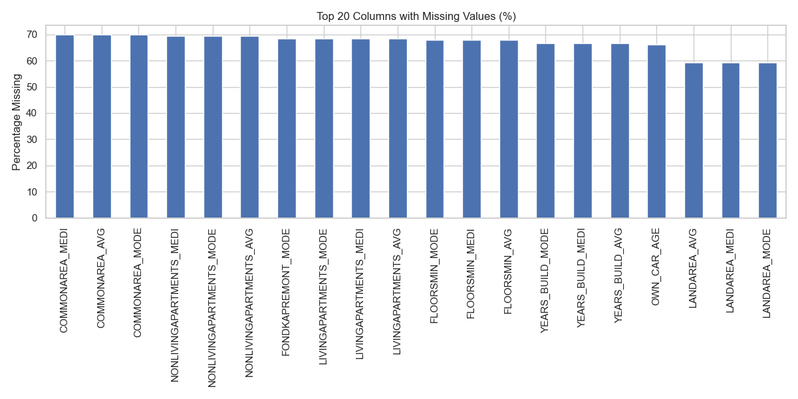
-   **Outliers**:
    -   **Income**: `AMT_INCOME_TOTAL` shows extreme outliers (e.g., max value is likely an error or a very high-net-worth individual). These will need capping or log-transformation.
    
    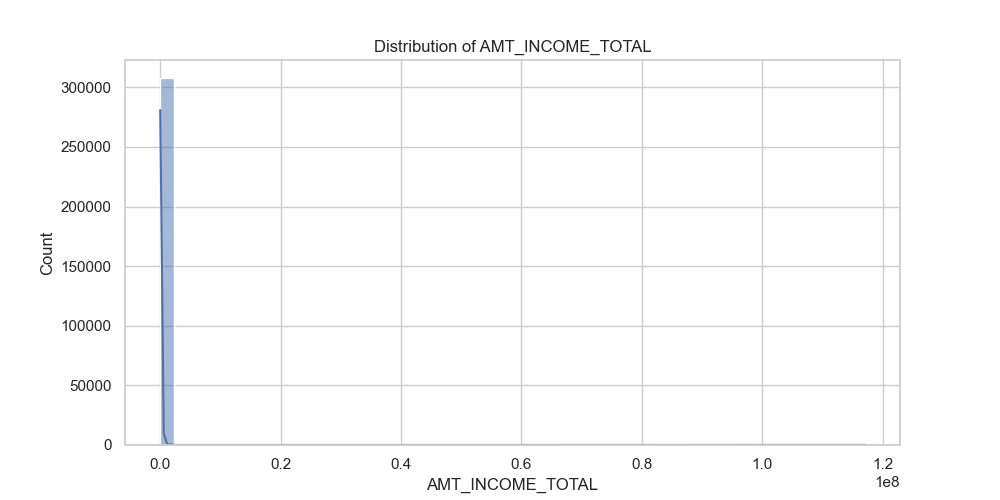
    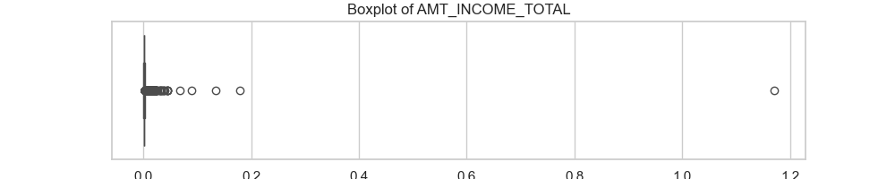
    -   **Days Employed**: There are anomalous values (e.g., 365243) which likely represent a placeholder for "unemployed" or "pensioner". This needs to be cleaned.
-   **Class Imbalance**:
    -   The dataset is highly imbalanced with **~91.9% Non-Defaults** and **~8.1% Defaults**. This will require handling techniques like SMOTE or adjusting class weights during modeling.

## 3. Initial Exploratory Insights

### Borrower Profiles & Default Proportions
-   **Target Distribution**: The vast majority of loans are repaid. The 8% default rate is the critical minority we need to characterize.
-   **Contract Type**:
    -   *Cash Loans*: Make up the majority of applications.
    -   *Revolving Loans*: Have a lower volume but potentially different risk profile.
    
    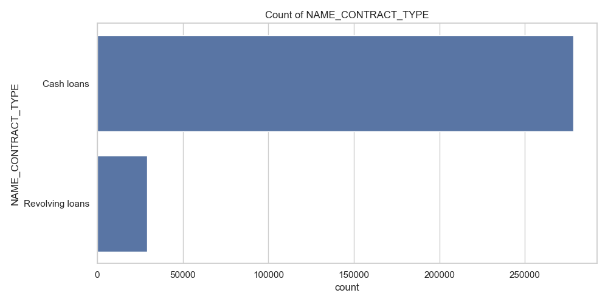
    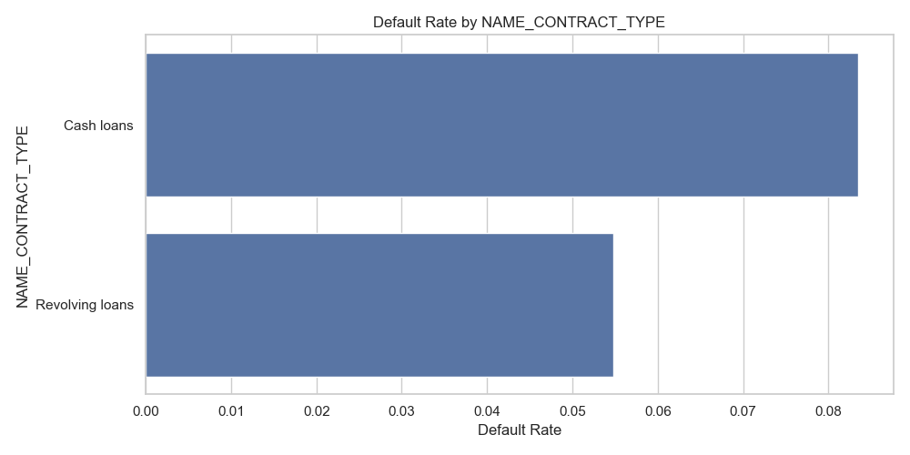
-   **Gender**:
    -   Females tend to apply more frequently than males.
    -   *Insight*: Initial checks suggest males might have a slightly higher default rate (to be confirmed with statistical tests).
    
    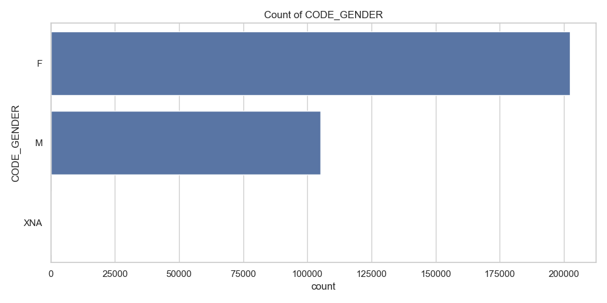
    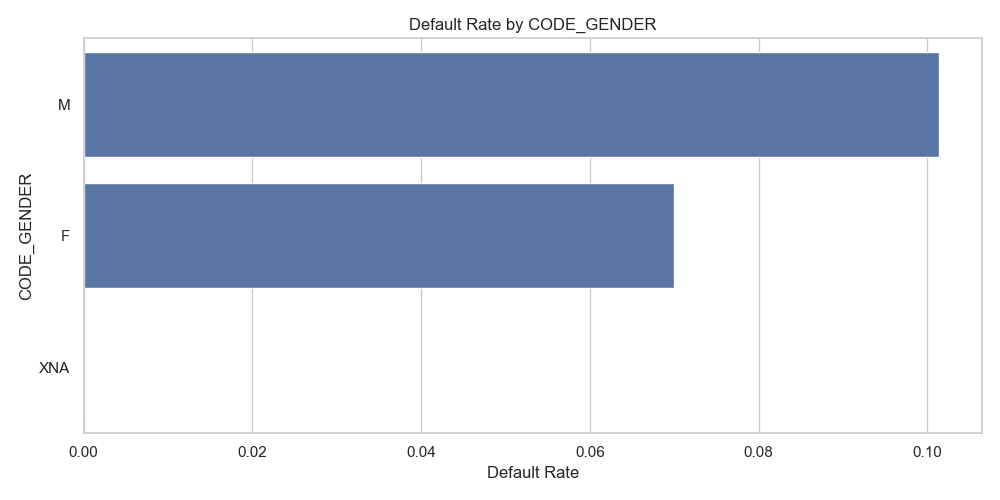
-   **Education**:
    -   Applicants with "Secondary / secondary special" education are the most common.
    -   *Insight*: Higher education levels generally correlate with lower default rates.
    
    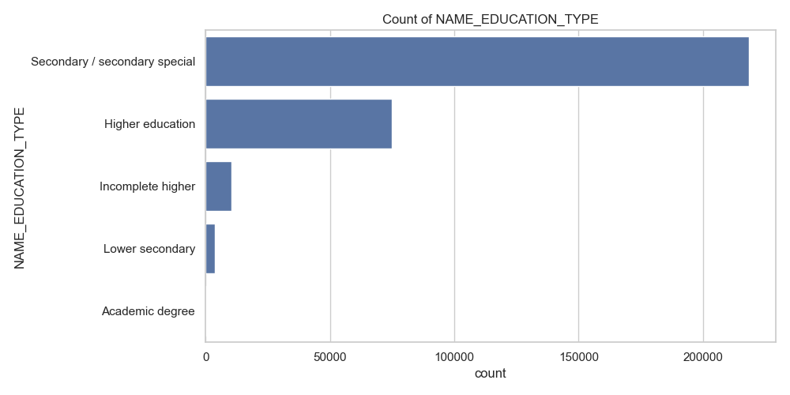
    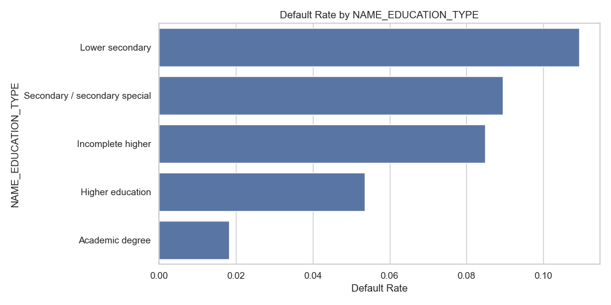
-   **Financials**:
    -   **Credit Amount**: Distribution is right-skewed. Most loans are for smaller amounts, but there is a long tail of high-value loans.
    -   **Income**: Highly skewed. Most applicants have low to medium income.
    
    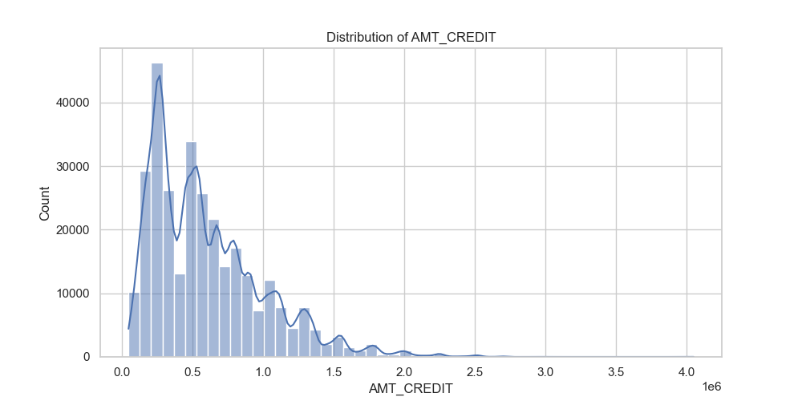
    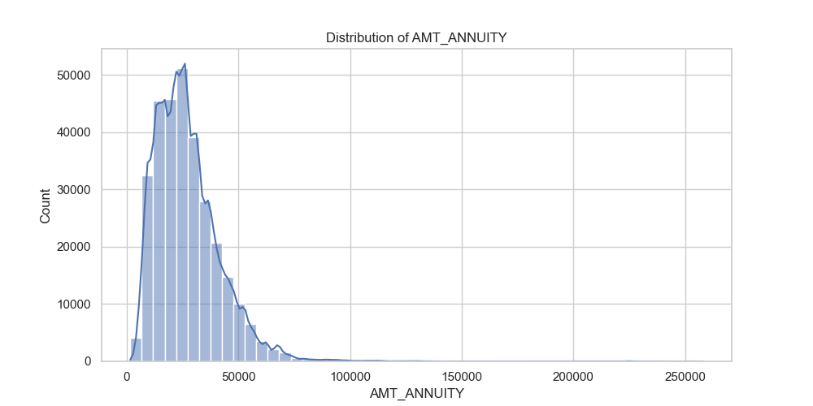

## 4. Concept Note

### Plan for Next Steps
1.  **Data Cleaning**:
    -   Handle missing values: Drop columns with >50% missing unless critical. Impute others.
    -   Fix anomalies: Correct the `DAYS_EMPLOYED` artifact (365243).
    -   Outlier Treatment: Cap extreme income values.
2.  **Feature Engineering**:
    -   Create ratios: `Credit-to-Income`, `Annuity-to-Income`.
    -   Binning: Group continuous variables like Age and Income into ranges.
3.  **Deep Dive Analysis**:
    -   Analyze the correlation between `EXT_SOURCE` scores and Target.
    -   Investigate the impact of previous loan rejections on current risk.
4.  **Dashboarding**:
    -   Build an interactive dashboard to allow the credit team to filter risk by demographic and financial segments.

### Initial Observations Summary
The data holds strong potential for predictive modeling but requires significant cleaning. The class imbalance is a major factor to consider. Key risk drivers appear to be education level, gender, and potentially the type of loan contract. The `EXT_SOURCE` variables (external credit scores) are likely to be strong predictors and should be prioritized despite missing values.
