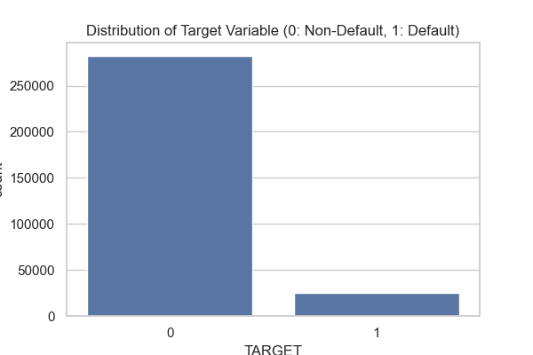
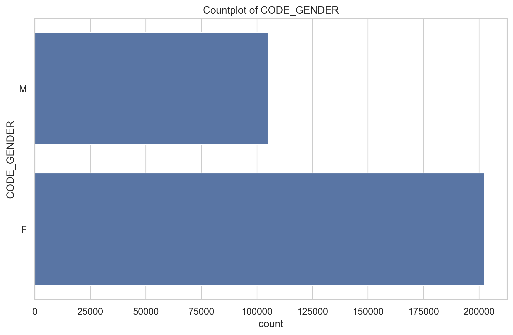
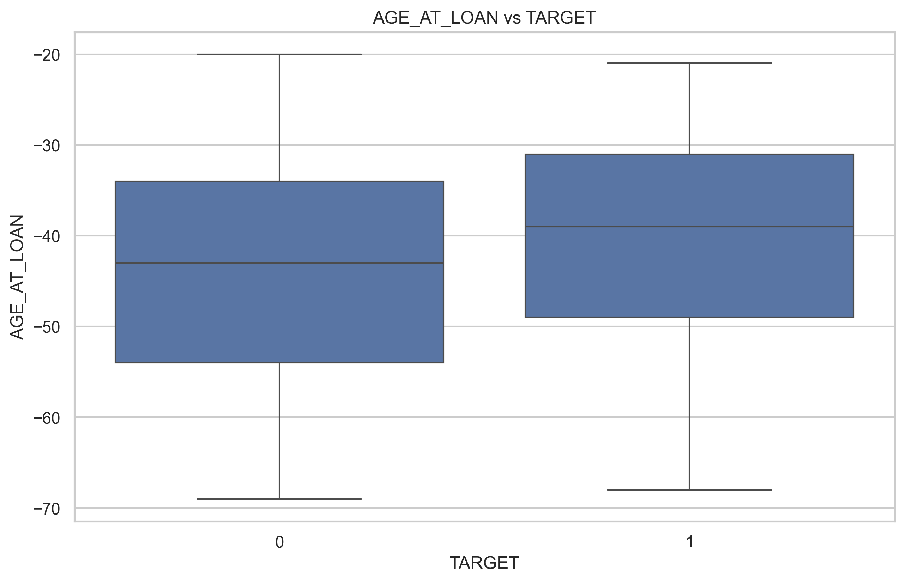
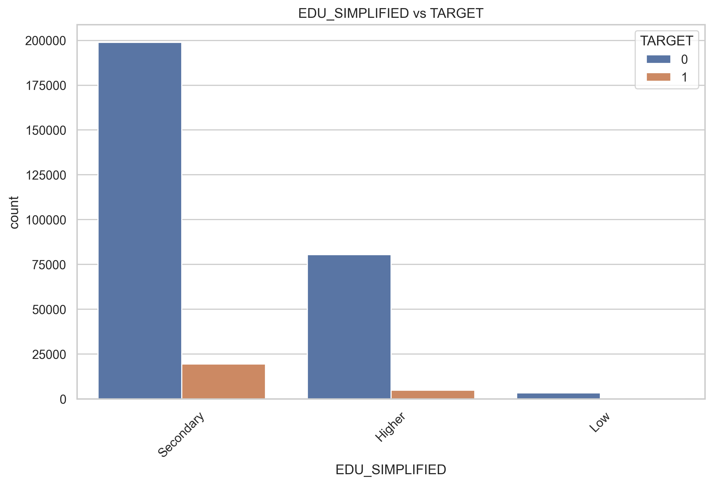
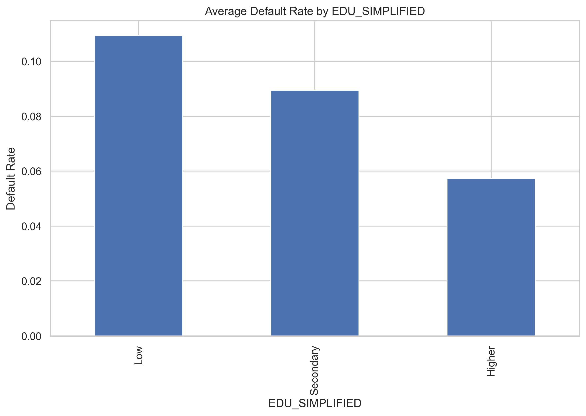
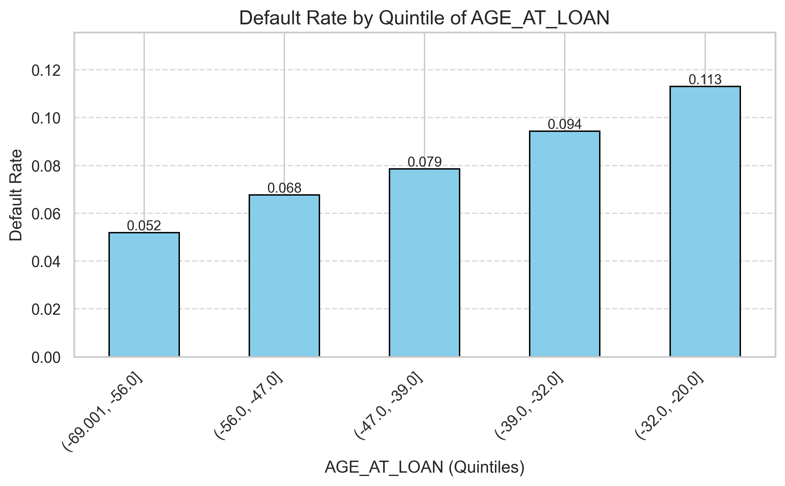
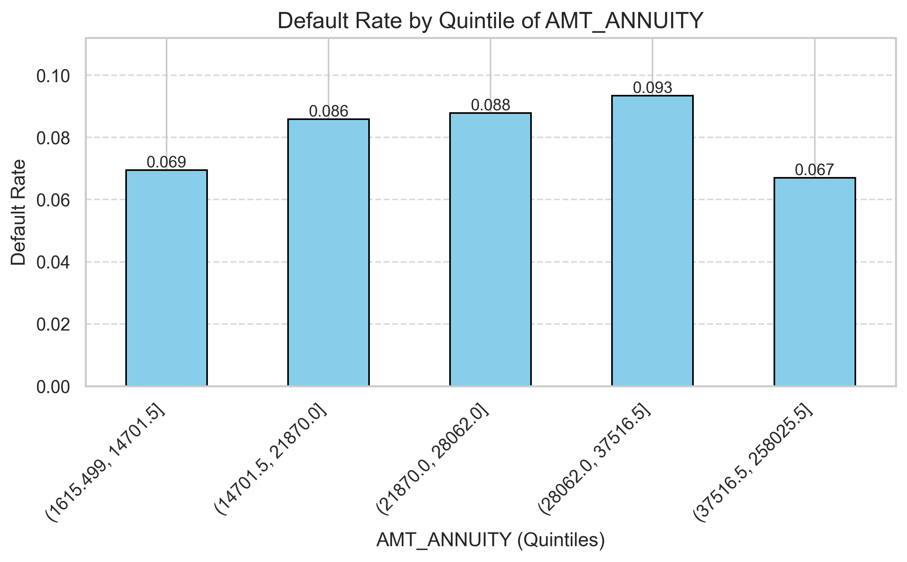
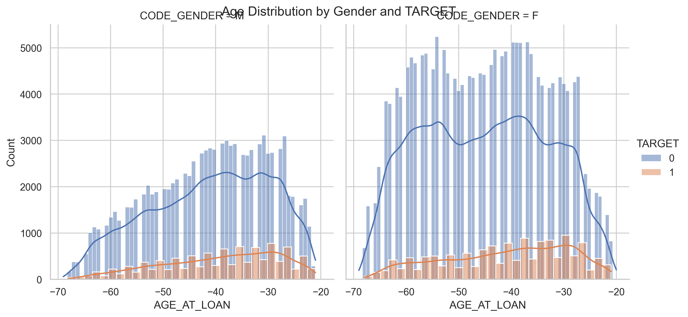

# Week 3: Deep Exploratory Analysis, Feature Validation & Risk Attribution

This document presents a **highly detailed,deep exploratory and validation analysis** performed on the finalized dataset. The purpose  is intentionally not model optimization, but **deep explainability and risk understanding** — clearly articulating *why* applicants default, *which financial, behavioral, and demographic signals matter most*, *how these signals interact*, and *how each analytical finding directly translates into actionable credit policy and business decisions*.
---

## 1. Final Dataset Overview

**Dataset Location**

```text
data/final_dataset/final_dataset.csv
```

**Granularity**

* One row represents one loan application
* One-to-one mapping with unique applicant ID (`SK_ID_CURR`)

**Target Variable**

* `TARGET = 1` → Client defaulted
* `TARGET = 0` → Client fully repaid or Not defaulted

**Why this matters**
All downstream analysis, modeling, and dashboards rely on this dataset as the *single source of truth*. Ensuring clarity at this stage prevents data leakage and misinterpretation later.

---

## 2. Feature Landscape & Grouping

To improve interpretability and avoid analytical bias, features are logically grouped before analysis.

### 2.1 Numerical Features

Numerical features represent **continuous risk signals** related to affordability, stability, and credit behavior.

Examples include:

* `AGE_AT_LOAN` – borrower maturity and life-stage stability
* `CREDIT_INCOME_RATIO` – repayment burden relative to income
* `ANNUITY_INCOME_RATIO` – monthly cash-flow stress
* `EXT_SOURCE_MEAN` – external credit bureau assessment
* `PREV_REFUSAL_RATE` – historical rejection behavior

**Analytical Focus**:

* Distribution shape (skewness, concentration)
* Outlier behavior
* Relationship with default probability

---

### 2.2 Categorical Features

Categorical features capture **structural and demographic context**.

Examples include:

* `CODE_GENDER`
* `NAME_CONTRACT_TYPE`
* `EDU_SIMPLIFIED`
* `ORGANIZATION_TYPE`

**Analytical Focus**:

* Frequency imbalance
* Category-level default concentration
* Statistical dependency with TARGET

---

## 3. Data Quality & Target Structure

### 3.1 Target Distribution



**What this plot shows**:

* A strong class imbalance with defaults forming a small minority

**Why this matters**:

* Accuracy alone is misleading
* Requires stratified sampling, ROC-AUC, and class weighting
* Reflects real-world credit portfolios

---

## 4. Univariate Analysis: Understanding Individual Signals

Univariate analysis focuses on **isolating each feature independently** to understand its natural distribution, stability, and inherent risk signal *before* considering interactions. This step is critical in credit risk because misleading distributions or extreme skewness can silently distort downstream models if not properly understood.

Univariate analysis helps answer: *What does a typical applicant look like?*

---

### 4.1 Numerical Feature Distributions

Each numerical feature is analyzed using **two complementary visualizations** to capture both central tendency and extreme behavior:

For each numerical feature:

* **Histogram + KDE** → overall distribution and skewness
* **Boxplot** → outliers and variability

**Typical Observations**:

* Income and loan amounts are heavily right-skewed
* Ratio features show tighter, more informative distributions
* Extreme values exist but are economically plausible

**Why this matters**:

* Guides transformations (log, capping)
* Prevents models from overfitting noise

Plots saved as:

```text
{feature}_histogram.png
{feature}_boxplot.png
```

---

### 4.2 Categorical Feature Distributions



**What this plot shows**:

* Relative frequency of each category

**Key Insight**:

* Some categories dominate volume but not necessarily risk
* Rare categories can carry disproportionate default rates

**Business Relevance**:
Volume ≠ Risk. Credit decisions must consider both.

---

## 5. Bivariate Analysis: Features vs Default

This section explains *how each feature behaves differently for defaulters vs non-defaulters*.

---

### 5.1 Numerical Features vs TARGET

This analysis compares how numerical feature values differ **between defaulters and non-defaulters**, helping determine whether a variable merely describes customers or truly differentiates risk outcomes.



**What this plot shows**:

* Distribution of borrower age across default outcomes

**Insight**:

* Younger applicants show higher default concentration
* Risk decreases with age up to a stability plateau

**Business Interpretation**:
Age acts as a proxy for income stability and credit maturity.

---

### 5.2 Categorical Features vs TARGET



**What this plot shows**:

* Default proportion within each education category

**Statistical Validation**:

* Chi-square tests confirm dependency
* Observed differences are statistically meaningful

**Business Interpretation**:
Education level indirectly reflects earning stability and employment quality.

---

## 6. Correlation Analysis

### 6.1 Full Correlation Heatmap

Correlation analysis is used here **strictly as a diagnostic tool**, not as a feature selection mechanism. In credit risk, strong linear correlations are rare; therefore, weak correlations do not imply irrelevance.


**What this shows**:

* Linear relationships between all numerical variables

**Key Observation**:

* Weak linear correlations are expected in credit risk
* Risk is driven by **non-linear interactions**

---

### 6.2 Correlation with TARGET

**Risk-Increasing Signals**:

* `PREV_REFUSAL_RATE`
* `CREDIT_GOODS_RATIO`
* `AGE_AT_LOAN`

**Protective Signals**:

* External credit scores
* Income-normalized ratios

---

### 6.3 Focused Correlation Heatmap

.png)

**Insight**:
Only a limited subset shows linear signal — engineered features matter most.

---

## 7. Multivariate Analysis

### 7.1 Average Default Rate by Category



**What this shows**:

* Risk varies significantly within categories

**Why it matters**:

* Supports segmentation-based policy rules

---

### 7.2 Numerical Binning & Risk Trend






**Insight**:

* Clear monotonic increase in default
* Validates ratio-based feature engineering

---

### 7.3 Interaction Analysis



**What this reveals**:

* Gender alone is weak
* Gender *within age bands* modifies risk

**Modeling Implication**:
Supports interaction-aware models.

---

## 8. Outlier Analysis (IQR Method)

**Approach**:

* Applied IQR on numerical variables only
* IDs and target excluded

**Findings**:

* Outliers concentrated in income and loan size
* Represent real but high-risk applicants

**Action**:
Outliers retained but handled via robust modeling.

---

## 9. Feature Importance Validation (Random Forest)

This section validates all exploratory findings using a **tree-based, non-linear ensemble model**, ensuring that insights derived from EDA are not purely visual but hold predictive value in a supervised learning context.


**Purpose**:

* Validate EDA insights using a non-linear model

**Top Drivers Identified**:

* `EXT_SOURCE_MEAN`
* `CREDIT_GOODS_RATIO`
* `AGE_AT_LOAN`
* `PREV_REFUSAL_RATE`
* `ANNUITY_INCOME_RATIO`

**Model Performance**:

* ROC-AUC: **0.7549**

**Interpretation**:
Strong discrimination for baseline risk validation.

---

## 10. Risk Scoring & BI Readiness

Each application enriched with:

* `RISK_PROBA` – predicted default probability
* `RISK_SCORE` – scaled 0–1000 risk score

**Output File**

```text
data/final_dataset/FINAL_DATASET_FOR_WITH_RISK_SCORE.csv
```

**Business Value**:

* Plug-and-play Power BI integration
* Enables thresholding, segmentation, and monitoring

---

## 11. Final Outcomes

* Clear identification of default drivers
* Strong alignment between EDA and model validation
* Reduced noise before advanced modeling
* Business-ready risk interpretation

